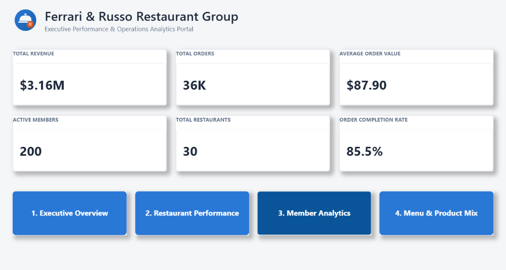
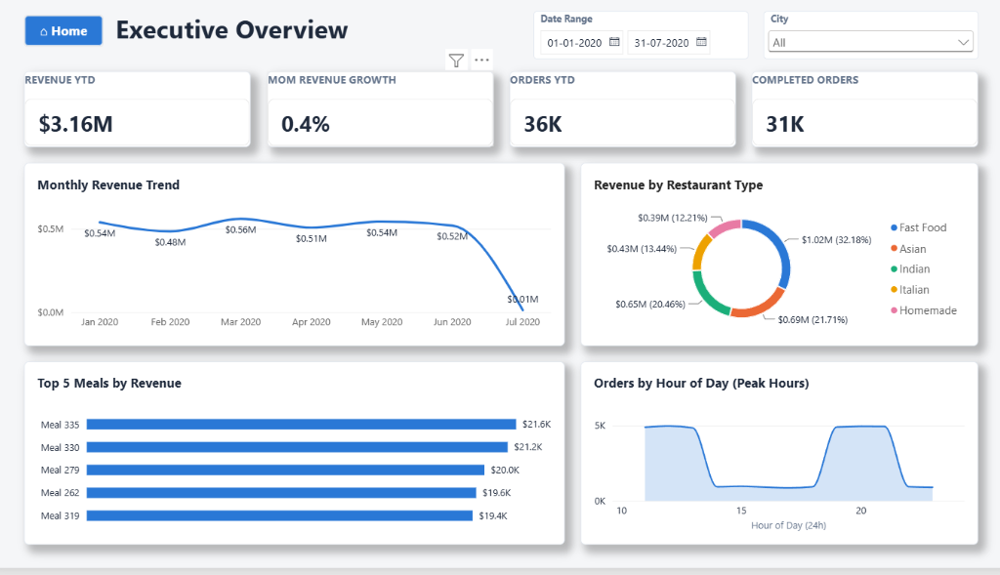
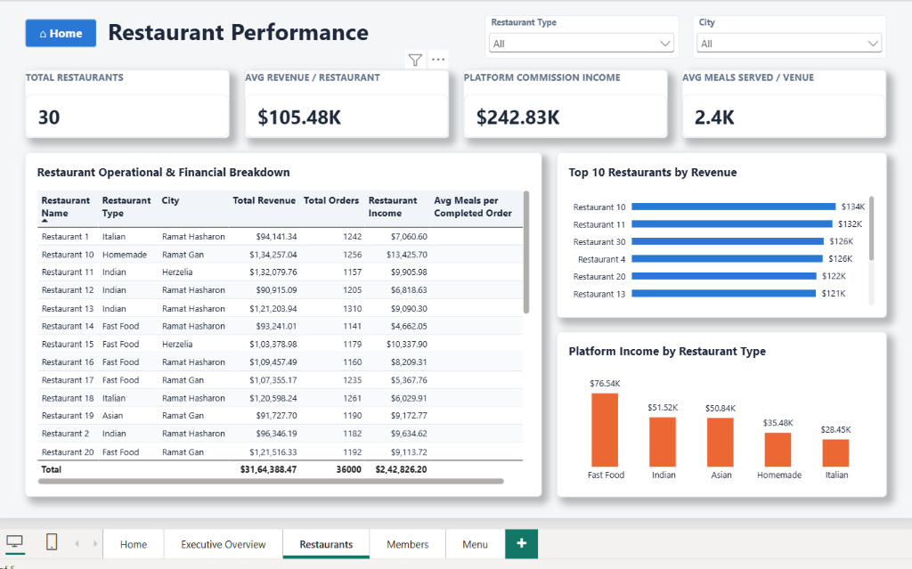
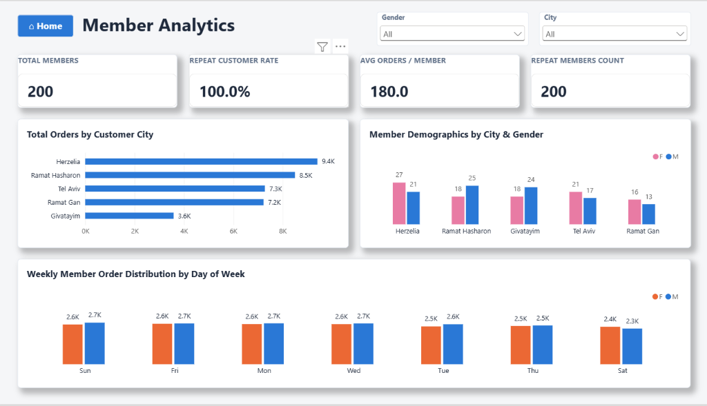
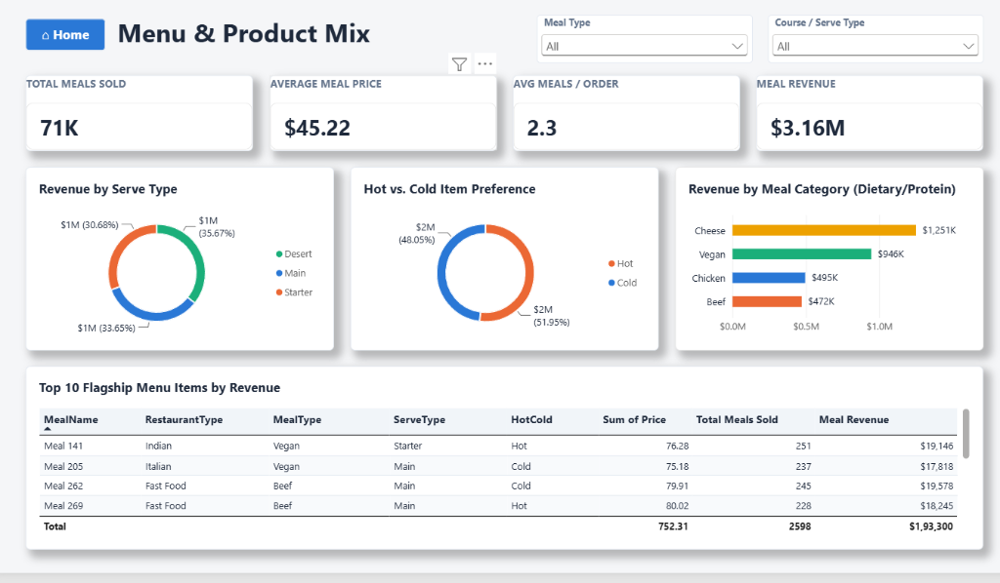

# 🍽️ Ferrari & Russo Restaurant Group — Executive Analytics Portal

[](https://powerbi.microsoft.com/)
[](https://learn.microsoft.com/en-us/dax/)
[]()
[]()

An end-to-end Enterprise Business Intelligence and Decision Support System engineered for **Ferrari & Russo Restaurant Group**, a multi-venue hospitality platform operating across 30 partner restaurants in 5 metropolitan cities.

---

## 📸 Executive Dashboard Walkthrough

### 1. Landing Hub & Executive Portal
*Macro business pulse, top-line operational metrics, and role-based portal navigation.*


---

### 2. Executive Overview (Timing Dynamics & Category Share)
*Bimodal peak capacity analysis, monthly GMV trajectory, and share-of-wallet cuisine distribution.*


---

### 3. Restaurant Performance (B2B Monetization & Commission)
*Venue-level operational audit, top 10 billing rankings, and take-rate profitability matrix.*


---

### 4. Member Analytics (Demographics & Purchasing Velocity)
*Loyalty retention, municipal geographic clustering, and day-of-week purchasing cadence.*


---

### 5. Menu & Product Mix (SKU Contribution & Unit Economics)
*Course contribution, hot vs. cold temperature split, and flagship SKU profitability breakdown.*


---

## 🏛️ Business Architecture & Problem Statement

Ferrari & Russo operates as a multi-brand dining platform connecting **200 high-frequency loyalty members** with **30 partner restaurant kitchens** across 5 municipalities.

### Key Business Challenges Addressed:
1. **Intraday Kitchen Capacity & Staffing Surges**: Identifying exact meal rush periods to eliminate driver idle costs and kitchen prep bottlenecks.
2. **Checkout Conversion Leak**: Pinpointing why 14.5% of checkout sessions resulted in abandoned or unfulfilled orders ($450K+ lost GMV).
3. **B2B Take-Rate Optimization**: Analyzing partner take-rates to renegotiate low-margin contracts (e.g. 5% vs 10% take-rate disparities).
4. **Geographic Fleet Allocation**: Determining municipal demand clusters to prioritize delivery partner recruitment.

---

## 📐 Data Model & Architecture (Star Schema)

The underlying semantic model integrates **10 relational tables** in a pure Kimball-style **Star Schema** optimized for Power BI’s in-memory VertiPaq engine:

```
                           ┌──────────────────────────┐
                           │      Date Dimension      │
                           └─────────────┬────────────┘
                                         │ 1
                                         │ *
┌────────────────┐ 1           * ┌───────┴──────┐ *           1 ┌────────────────┐
│    members     ├───────────────┤    orders    ├───────────────┤  restaurants   │
└───────┬────────┘               └───────┬──────┘               └───────┬────────┘
        │ * (Inactive)                   │ 1                            │ 1
        │                                │ *                            │
        │ 1                              │                              │ *
┌───────┴────────┐               ┌───────┴──────┐ *           1 ┌───────┴────────┐
│     cities     ├───────────────┤ order_details├───────────────┤restaurant_types│
└────────────────┘ 1           * └───────┬──────┘               └────────────────┘
                                         │ *
                                         │ 1
                                 ┌───────┴──────┐
                                 │    meals     │
                                 └───────┬──────┘
                                         │ *
                           ┌─────────────┴────────────┐
                         1 │                        1 │
                  ┌────────┴──────┐          ┌────────┴──────┐
                  │  meal_types   │          │  serve_types  │
                  └───────────────┘          └───────────────┘
```

### Architectural Decisions:
* **Single-Direction Cross-Filtering ($1 \rightarrow *$)**: Enforced across all relationships to prevent non-deterministic filter propagation and optimize VertiPaq memory compression.
* **Inactive Ambiguity Resolution (`USERELATIONSHIP`)**: The relationship between `cities` and `members` is kept **inactive** to avoid circular loops between venue revenue and member residence paths. It is activated dynamically via DAX for demographic analysis.
* **Decoupled Measure Repository**: All 23 business calculations reside inside a dedicated `KPI Measures` table.

---

## 📊 Key DAX Measures Catalog

All calculations are built as **explicit DAX measures**:

| Measure Name | DAX Expression | Business Purpose |
| :--- | :--- | :--- |
| **Total Revenue** | `SUM(orders[TotalOrder])` | Measures gross platform GMV ($3.16M). |
| **Revenue YTD** | `TOTALYTD([Total Revenue], 'Date'[Date])` | Cumulative year-to-date sales run-rate. |
| **Completed Orders** | `CALCULATE([Total Orders], orders[OrderStatus] = "Completed")` | Counts fulfilled transactions (30,780). |
| **Order Completion Rate** | `DIVIDE([Completed Orders], [Total Orders])` | Evaluates fulfillment health (85.5%). |
| **Avg Order Value (AOV)** | `DIVIDE([Total Revenue], [Completed Orders])` | Average basket size per completed order ($87.90). |
| **Restaurant Income** | `SUMX('orders', RELATED('restaurants'[IncomePercentage]) * orders[TotalOrder])` | Platform commission net revenue ($242.83K). |
| **Meal Revenue** | `SUMX(order_details, RELATED(meals[Price]))` | Bottom-up line-item revenue verification ($3.16M). |
| **Active Members** | `CALCULATE(COUNTROWS('members'), USERELATIONSHIP('cities'[CityID], 'members'[CityID]))` | Demographic counting utilizing inactive relationship. |
| **Repeat Customer %** | `DIVIDE([Repeat Customers], [Total Customers])` | Measures member loyalty retention (100.0%). |
| **Orders Per Customer** | `DIVIDE([Total Orders], [Total Customers])` | Purchasing cadence per customer (180 orders / 7 mo). |

---

## 💡 Executive Insights & Strategic Decisions

1. **Bimodal Peak Capacity Guidance**:
   * Demand surges during **Lunch (11 AM–1 PM)** and **Dinner (7 PM–9 PM)** reaching a 5,000-order ceiling, with an **80% volume collapse** from 2 PM–5 PM.
   * *Decision*: Implement split-shift kitchen staffing and concentrate delivery surge incentives strictly during peak windows.
2. **Monetization Take-Rate Disparity**:
   * While top partners (`Restaurant 10` & `11`) generate over $130K, contract commission spreads range from 5% to 10%, heavily impacting net income.
   * *Decision*: Renegotiate contracts with high-volume, low-take-rate venues (e.g. `Restaurant 18` at 5%) to a standardized 8%–10% tier.
3. **Geographic Demand Clustering**:
   * **Herzelia (9.4K orders)** and **Ramat Hasharon (8.5K orders)** account for ~50% of total platform volume.
   * *Decision*: Prioritize driver fleet onboarding and dark kitchen expansion in these two high-density zones.
4. **Plant-Based & Specialty Dairy Economics**:
   * **Cheese ($1.25M)** and **Vegan ($946K)** dishes account for 69% of menu sales, outperforming Chicken and Beef combined.
   * *Decision*: Expand the plant-based catalog and bundle Main + Dessert combos to grow basket size from 2.3 to 3.0 items.

---

## 🚀 How to Run the Project

1. **Prerequisites**:
   * Install [Power BI Desktop](https://powerbi.microsoft.com/desktop/) (Latest Version).
2. **Clone the Repository**:
   ```bash
   git clone https://github.com/Yeshwanth-Kumar-H/Restaurant-Analytics-PowerBI.git
   ```
3. **Open the Report**:
   * Open `Restaurant Dashboard.pbix` in Power BI Desktop.
   * All data models, relationships, and DAX measures will load automatically.

---

## 👤 Author
**Yeshwanth Kumar H**  
*Data Analyst & BI Solution Architect*  
* [LinkedIn Profile](https://www.linkedin.com/in/yeshwanth-kumar-h/)
* [GitHub Profile](https://github.com/Yeshwanth-Kumar-H)
