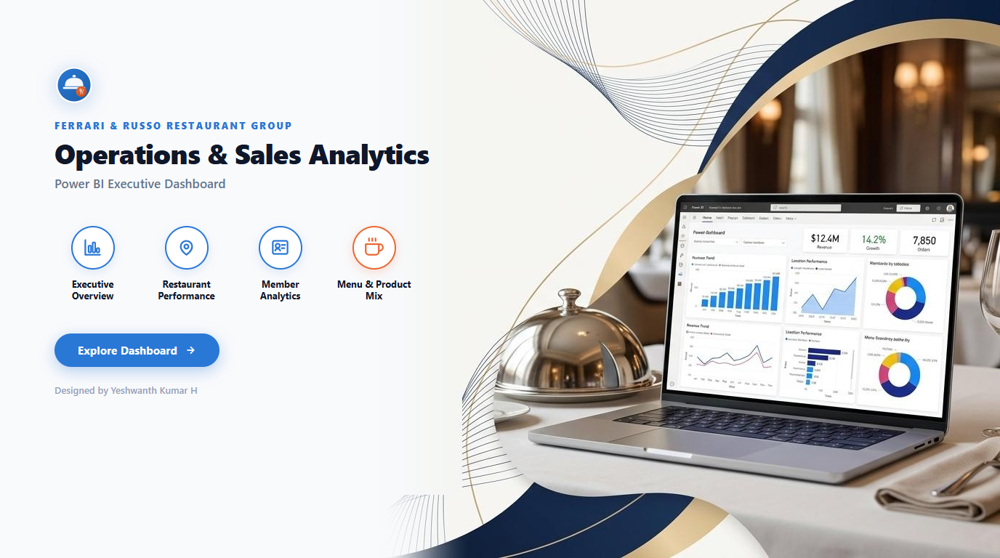

# Ferrari & Russo Restaurant Group — Power BI Dashboard

This project is an interactive Power BI dashboard built for **Ferrari & Russo Restaurant Group**, a multi-brand restaurant business operating across 30 partner restaurants in 5 cities.

The dashboard helps managers and executives track daily operations, understand sales trends, evaluate partner restaurant performance, and see which menu items drive the most revenue.

---

## Dashboard Pages

### 1. Cover Page & Navigation Portal
Welcome screen featuring brand identity, direct page navigation, and quick access to all reporting modules.

---

### 2. Landing Page (KPI Summary)
High-level overview showing top-line revenue, completed order volume, active members, and quick links across the report.

---

### 3. Executive Overview
Focuses on overall sales trends, monthly comparisons, and peak ordering hours throughout the day.

---

### 4. Restaurant Performance
Breaks down revenue, order volume, and commission earned by each partner restaurant, highlighting top-earning locations.

---

### 5. Member Analytics
Analyzes customer distribution across cities, purchasing frequency, and member loyalty patterns.

---

### 6. Menu & Product Mix
Examines meal sales across courses, food categories (Vegan, Cheese, Meat), and cold vs. hot dishes to identify customer favorites.

---

## Key Insights from the Data

- **Order Timing (Peak Rush Hours)**:
  - Orders spike heavily during **Lunch (11 AM – 1 PM)** and **Dinner (7 PM – 9 PM)**.
  - The afternoon between 2 PM and 5 PM sees very low order volume, pointing to opportunities for afternoon promotions or adjusting kitchen shifts.

- **Top Cities**:
  - **Herzelia** and **Ramat Hasharon** make up over **50% of all orders**, making them the most critical delivery zones.

- **Menu Preferences**:
  - **Cheese** and **Vegan** dishes generate the largest share of food revenue, outperforming standard meat options.

- **Partner Performance**:
  - A small group of high-volume restaurants drives the majority of commission income, showing where partner relationships matter most.

---

## Data Model

The data is modeled using a standard **Star Schema** in Power BI:
- **Fact Tables**: orders, order_details
- **Dimension Tables**: 
estaurants, members, meals, cities, meal_types, 
estaurant_types, serve_types, and a dedicated Date table.

All metrics (Total Revenue, Completed Orders, Average Order Value, Commission, etc.) are built using clean, explicit DAX measures.

---

## Tools Used

- **Power BI Desktop** (Data modeling, DAX measures, Report design)
- **Power Query** (Data cleaning, date transformations, schema modeling)
- **DAX** (Custom measures, time intelligence, dynamic KPI calculations)

---

## How to Run This Project

1. Download or clone this repository:
   `ash
   git clone https://github.com/Yeshwanth-Kumar-H/Restaurant-Analytics-PowerBI.git
   `
2. Open Restaurant Dashboard.pbix in [Power BI Desktop](https://powerbi.microsoft.com/desktop/).
3. The report will load with all data models, visuals, and measures ready to explore.

---

## Author

**Yeshwanth Kumar H**  
- [LinkedIn Profile](https://www.linkedin.com/in/yeshwanth-kumar-h/)
- [GitHub](https://github.com/Yeshwanth-Kumar-H)
